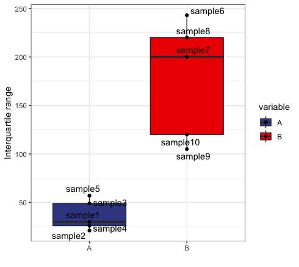

# Protocol for Evaluating the Loss of Stoichiometry and Coordinated Expression of Proteins

Here we provide provide R functions to quantify the loss of stoichiometry for protein complexes in omics data as explained in the STAR Protocols paper.

## Example work flow

Prepare the workspace

```r
library(readr)
library(ggplot2)
library(dplyr)
library(ggrepel)
library(ggsci)


# Load the data 

data <- read_csv("example_gene_data.csv")

#source the functions

source("clean_functions.R")

```


The data here is synthetic RNA seq data with a total of 10 samples and 2 conditions.


```r
head(data)

# Symbol name    value variable
#  <chr>  <chr>   <dbl> <chr>   
#1 gene1  sample1     2 A       
#2 gene1  sample2     4 A       
#3 gene1  sample3     8 A       
#4 gene1  sample4     0 A       
#5 gene1  sample5     1 A       
#6 gene2  sample1    59 A 
```

The IQR analyses are aimed to compare two genesets to see if those change - get deregulated (meaning increasing in IQR) - over a variable such as time, age, treatment.

To calculate IQR for the two groups shown above we need to define a geneset first.
In this example just 5 genes. If no geneset is supplied the IQR analyses are performed with the entire supplied dataframe.

```r
geneset <- c("gene1", "gene2", "gene3", "gene4", "gene5")
```


From there we can run the `stoichiometry()` function.
This function requires a couple of inputs detailed below:


     symbol        - character vector of gene symbols
     expression    - numeric vector of expression values
     variable      - character or factor vector with group information 
                     (e.g. age group or treatment)
     sample        - character vector of sample IDs
     geneset       - character vector of interested genes 
                     (same nomenclature as symbol)
                     if no geneset is supplied IQR analyses are performed based on all provided symbols


The output of `stoichiometry()` is a dataframe that you can use for stat tests e.g.:

```r
stoi <- stoichiometry(expression = data$value,
                      symbol = data$Symbol,
                      variable = data$variable,
                      geneset = c("gene1", "gene2", "gene3", "gene4", "gene5"),
                      sample = data$name)
                      
                      
head(sttoi)
#   variable rep        IQR
#   <fct>    <chr>    <dbl>
# 1 A        sample1     30
# 2 A        sample2     21
# 3 A        sample3     49
# 4 A        sample4     26
# 5 A        sample5     57
# 6 B        sample10   120
```


```r
t.test( stoi$IQR ~stoi$variable)


#	Welch Two Sample t-test
#
# data:  stoi$IQR by stoi$variable
# t = -4.9643, df = 4.5092, p-value = 0.005601
# alternative hypothesis: true difference in means is not equal to 0
# 95 percent confidence interval:
#  -216.46803  -65.53197
# sample estimates:
# mean in group A mean in group B 
#            36.6           177.6 

```

And there is a convenience plotting wrapper in `stoi_plot`


```r
stoi_plot(stoi)
```



An example pipeline can be accessed in the [run_IQR_script](run_IQR_script.R).


